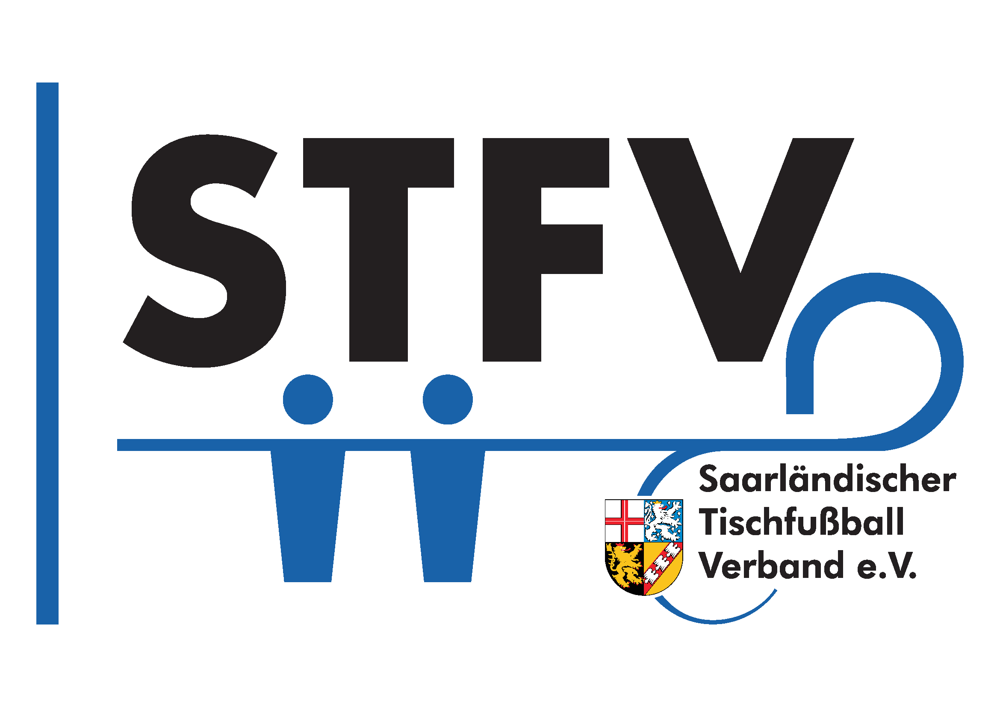

# Satzung des STFV e.V.

**Stand: 15.01.2023**

---

## Inhaltsverzeichnis

1. [Name und Sitz](#name-und-sitz)
2. [Zweck, Ziele und Aufgaben](#zweck-ziele-und-aufgaben)
3. [Mitgliedschaft](#mitgliedschaft)
4. [Wirtschaftsführung](#wirtschaftsführung)
5. [Organe des Verbandes](#organe-des-verbandes)
6. [Mitgliederversammlung](#mitgliederversammlung)
7. [Vorstand](#vorstand)
8. [Schiedsgericht](#schiedsgericht)
9. [Protokollierung von Beschlüssen](#protokollierung-von-beschlüssen)
10. [Rechnungs- und Kassenprüfer](#rechnungs--und-kassenprüfer)
11. [Abstimmungen und Wahlen](#abstimmungen-und-wahlen)
12. [Auflösung des Verbandes](#auflösung-des-verbandes)

---

## § 1 Name und Sitz

1. Der Verband führt den Namen **Saarländischer Tischfußballverband e. V. (STFV e. V.)**.
2. Sitz des Verbandes ist **66564 Ottweiler**.
3. Der Verband ist im Vereinsregister beim Amtsgericht Ottweiler eingetragen.

---

## § 2 Zweck, Ziele und Aufgaben

1. Der STFV e.V. verfolgt ausschließlich und unmittelbar **gemeinnützige Zwecke** im Sinne des Abschnitts „steuerbegünstigte Zwecke“ der Abgabenordnung.
2. Er ist parteipolitisch, rassisch und religiös neutral und wahrt weltanschauliche Toleranz.
3. Hauptzwecke sind:
   - Förderung des Tischfußballsports,
   - Jugendarbeit im Bereich Tischfußballsport,
   - Förderung des Breiten-, Freizeit-, Leistungs- und Spitzensports.
4. Der Verband vertritt die Interessen seiner Mitglieder gegenüber Öffentlichkeit, Behörden und anderen Organisationen.
5. Der Wirkungsbereich umfasst das Saarland und angrenzende Regionen in Rheinland-Pfalz.

---

## § 3 Mitgliedschaft

1. Mitglied werden können:
   - Tischfußballvereine im Wirkungsbereich des STFV,
   - Aktive Mitglieder (am Spielbetrieb teilnehmend oder in Vereinsführung tätig),
   - Passive Mitglieder,
   - Ehrenmitglieder und Ehrenvorsitzende,
   - Fördernde Mitglieder.
2. Mitgliedschaft endet durch:
   - Austritt,
   - Ausschluss,
   - Auflösung des Verbandes.

---

## § 4 Wirtschaftsführung

1. Geschäftsjahr ist das Kalenderjahr.
2. Der Vorstand erstellt jährlich einen Haushaltsplan und legt eine Jahresabrechnung vor.
3. Der Hauptkassierer ist für die ordnungsgemäße Führung der Kasse verantwortlich.

---

## § 5 Organe des Verbandes

1. Mitgliederversammlung
2. Vorstand
3. Schiedsgericht
4. Spielbetriebskommission
5. Sport- und Regelkommission
6. Leistungssportkommission
7. Turnierleitungskommission
8. Jugendförderungskommission

---

## § 6 Mitgliederversammlung

1. Die Mitgliederversammlung ist das oberste Organ des Verbandes.
2. Sie findet einmal jährlich statt.
3. Aufgaben:
   - Beschlussfassung über Satzung, Beiträge und Haushaltsplan,
   - Wahl und Entlastung des Vorstandes,
   - Entscheidung über Anträge.
4. Beschlussfähigkeit:
   - Gegeben bei mindestens einem Drittel der stimmberechtigten Mitglieder.
   - Zweite Versammlung am gleichen Tag beschlussfähig unabhängig von der Anzahl der Anwesenden.

---

## § 7 Vorstand

1. Der Vorstand besteht aus:
   - geschäftsführendem Vorstand (1. Vorsitzender, 2. Vorsitzender, Schriftführer, Hauptkassierer),
   - erweitertem Vorstand (z. B. Leiter Spielbetriebskommission, Sport- und Regelkommission).
2. Amtsdauer: **2 Jahre** (Wiederwahl möglich).
3. Aufgaben:
   - Durchführung der Beschlüsse der Mitgliederversammlung,
   - Aufnahme, Ausschluss und Bestrafung von Mitgliedern.

---

## § 8 Schiedsgericht

1. Zusammensetzung: Vorsitzender, Stellvertreter, Beisitzer und Schiedsrichterobmann.
2. Zuständigkeit:
   - Entscheidung über Rechtsstreitigkeiten im Spielbetrieb,
   - Ahndung von Verstößen gegen Satzung und Spielbestimmungen.

---

## § 9 Protokollierung von Beschlüssen

1. Über Beschlüsse ist ein Protokoll zu erstellen und von Versammlungsleiter und Schriftführer zu unterzeichnen.
2. Protokoll der Mitgliederversammlung wird innerhalb von 4 Wochen auf der STFV-Homepage veröffentlicht.

---

## § 10 Rechnungs- und Kassenprüfer

1. Zwei Prüfer werden von der Mitgliederversammlung gewählt.
2. Einmalige Wiederwahl ist zulässig, jedoch scheidet bei jeder Wahl ein Prüfer aus.
3. Prüfer berichten der Mitgliederversammlung und beantragen Entlastung des Hauptkassierers.

---

## § 11 Abstimmungen und Wahlen

1. Beschlüsse:
   - Gefasst mit einfacher Stimmenmehrheit (Stimmenthaltungen zählen nicht).
   - Stimmengleichheit bedeutet Ablehnung.
2. Wahlen:
   - Vorsitzende in getrennten Wahlgängen mit absoluter Mehrheit,
   - Übrige Vorstandsmitglieder mit einfacher Mehrheit.

---

## § 12 Auflösung des Verbandes

1. Auflösung nur durch Mitgliederversammlung mit 3/4-Mehrheit.
2. Bei Auflösung fällt das Vermögen an den Deutschen Tischfußballbund e.V. zur Verwendung für gemeinnützige Jugendpflege.

---
